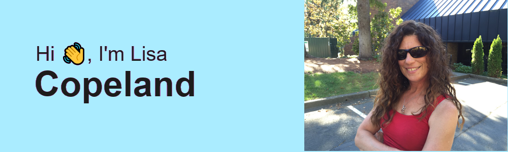

<!-- Banner -->

  

<h1 align="center">Hi, I’m Lisa Copeland</h1>

  Senior Full-Stack Developer • Angular Upgrades & Fixes • Node/TypeScript • .NET • AWS

  <a href="mailto:lisacope@msn.com"><b>Email</b></a> ·
  <a href="https://www.linkedin.com/in/your-handle" target="_blank"><b>LinkedIn</b></a> ·
  <a href="https://your-portfolio-site.com" target="_blank"><b>Portfolio</b></a>

---

## About me
I’m a full-stack engineer with 10+ years of experience shipping modern web apps and cloud services. I’m known for **quickly diagnosing tough Angular issues**, modernizing legacy code, and delivering clean, scalable solutions. I work across **Angular / Vue**, **Node.js/TypeScript** and **.NET**, and deploy to **AWS** (EC2, S3/CloudFront, API Gateway, Lambda, DynamoDB) with CI/CD.

- 🔧 Recent focus: Angular upgrades & rescue work, performance tuning, accessibility  
- ☁️ Cloud: AWS (primary), plus Azure & Google Cloud experience  
- 🔐 Auth: JWT / OAuth2, Okta; healthcare flows (Epic FHIR / SMART-on-FHIR)  
- 🧰 Databases: DynamoDB, MongoDB (Atlas / GridFS), SQL

---

## Tech I use

  <!-- Frontend -->
  
  
  
  
  <!-- Backend -->
  
  
  
  <!-- Cloud -->
  
  
  
  <!-- Data -->
  
  
  
  <!-- Auth / Tools -->
  
  
  

---

## Selected work
- **DrainData** — Patient app to track JP drain output (Angular/Vue, .NET & Node APIs, DynamoDB). Exploring **Epic FHIR / SMART-on-FHIR** for clinician tools.  
- **StoryTaim** — Creative-writing platform (Node/TS, MongoDB Atlas + GridFS, AWS).  
- Various client projects: **Angular migrations**, performance/a11y fixes, CI/CD, secure integrations.

> Want to collaborate or need an Angular upgrade/rescue?  
> **👉 <a href="mailto:lisacope@msn.com">Email me</a>** or **book a call** via my portfolio.

---

## Extras
- 🐎 Co-run **San Sebastian Equestrian Center** (I built and maintain the site/ops).  
- 🧭 Enjoy travel planning & complex logistics.  
- 🧑‍🏫 Mentor devs and write DX notes.

